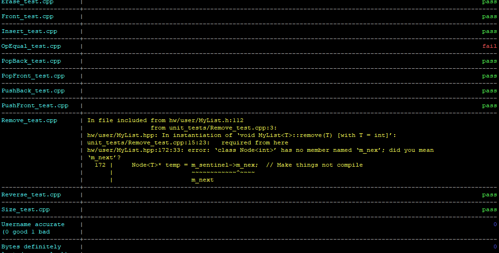

# CS1575AutoSubmission
Designed and built for CS1575, these two scripts automate the process of submitting homework and display the results of the autograder.

# show_results.py
Opens a file passed as a command line argument (defaults to "results.csv") and outputs a nicely formatted list of the results of all the test cases.

Change column widths with the constants at the top of the file.

# submit.sh
Pushes all changes to github and waits for the autograder to complete. Displays results of autograder once done (using show_results.py).

# How to use
1. Clone your homework repository (either to your machine or the campus machines via Putty)
2. Download this repository as a .zip file and extract it.
3. Copy and paste the contents of the src folder (submit.sh and show_results.py) into your project.
4. Add `submit.sh` and `show_results.py` to your `.gitignore`.

Once you've completed the above steps, make any changes you want to your local repository, then run the command `submit.sh` to activate the submission script. After about two minutes or so, your results will be outputted. If this process hangs for more than five minutes, then you can stop it with ctrl+c and run `git pull` manually (typically if this happens it signals that the autograder has crashed).

To view your results.csv file, run the command `show_results.py` at any time.
